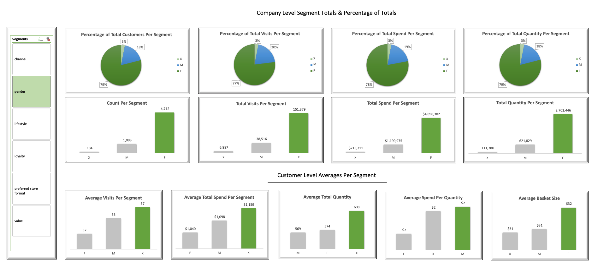
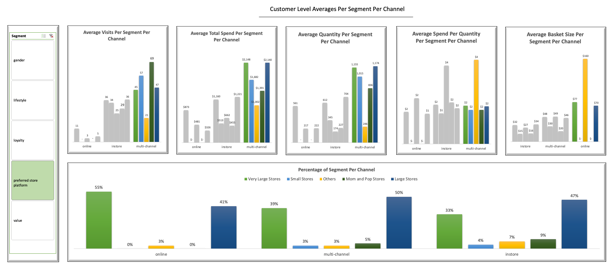

# Retail Analysis

The analysis looked to perform univariate, bivariate, and multivariate analysis to gain a better understanding of the retailer's economics regarding customer attributes and transactions.

The target segments of the analysis were the different shopping channels and value-type customers. 

## Results Summary 

* ABC's Online format showed strength in basket sizes. When observing the Online format an average of $79 per basket was observed, which's 72% larger than the next highest belonging to Multi-Channel with $44 per basket. 

* Online had some drawbacks with a total of only 29 shoppers, 66% are Low-Value, and only 3% are High-Value. 

* Despite the online format having few High-Value customers, the High-Value customers were of Higher value than Multi-Channel's High-Value customers with a greater total spend by 17%, 53% greater quantity sold, 23% less spend per item, and 212% greater basket sizes.

* Multi-Channel showed strength with consistency in value metrics. Multi-Channel had many High-Value, Very Affluent, and Loyal customers. 

* When separating the Instore and Online only transactions from Multi-Channel, the power of the Online platform was apparent in terms of what was spoken about earlier, in addition, the power and consistency of ABC's legacy Instore format was also apparent. 

* Blending the Online and Instore formats creates a Multi-Channel format that seems to generate value for both the customers and the business. Customers here spent, visited, and purchased more items consistently in comparison to the other channels. 

## Recommendations

1. Invite Instore only customers to the Online format. This can be done using various promotions at test locations.
2. Invite Online only customers to the Instore format. This can be done using various promotions at test locations.

## Further Questions

1. Does Online have a cheaper model with a larger return on investment? Is this why Customer pay less and shop more?
2. Can a sticky environment be created to generate consistent numbers like Multi-Channel but at the same time maintain the high number of Online only shopping? 
3. Can a sticky environment be created for consumers by moving consumers to a Multi-Channel format but at the same time maintain the high number or increase the Online only shopping in pursuit of the higher margins? 

### Dashboards

**Univariate & Bivariate Dashboard**:

**Bivariate & Multivariate Dashboard**:

## Technologies 

1) MySQL
2) MySQL Workbench
3) Microsoft Excel
4) Python
5) Jupyter Notebook

## Directory Files

1) **Segment_Analysis_Dashboard.xlsx** - Retail Analysis in Microsoft Excel plus dashboards (same as MySQL).
2) **Unpivot_Data.ipynb** - Data unpivoted to aid in dashboard creation in Microsoft Excel.
3) **ABC_Segment_Analysis.sql** - Retail Analysis in MySQL (same as Microsoft Excel).
4) **Stored_Procedures.sql** - Stored procedures to aid the retail analysis in MySQL.
